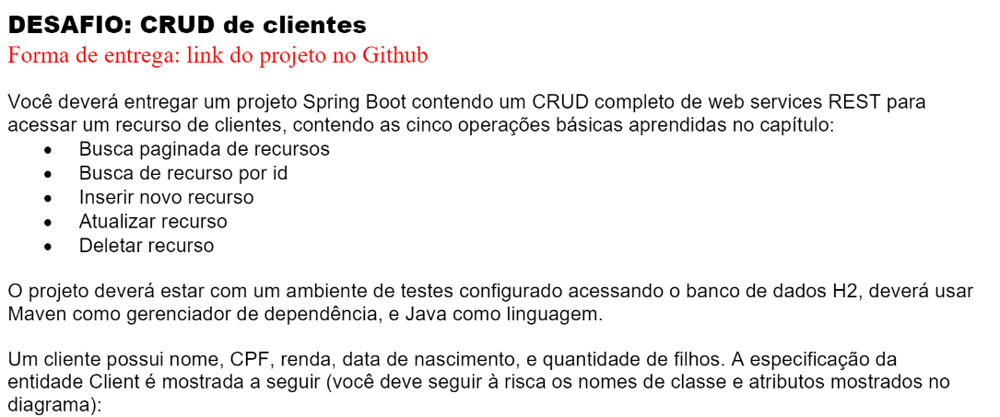
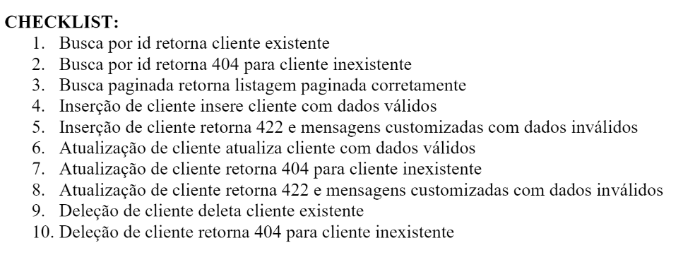

# Desafio CRUD - DevSuperior

## Tecnologias Utilizadas

- **Spring Boot**: Framework para desenvolvimento de aplicações Java.
- **Spring Data JPA**: Integração do Spring com o banco de dados utilizando JPA.
- **H2 Database**: Banco de dados em memória para persistência dos dados.
- **Spring Web**: Para criar uma API REST.

## Funcionalidades

### Passos

1. Clone o repositório:
  https://github.com/MarcelloJPA/DesafioCRUDSpring.git

